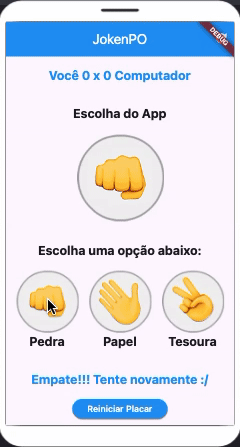

# JokenPO App

O **JokenPO App** é um jogo simples de **Pedra, Papel e Tesoura** desenvolvido com Flutter. O app permite que o usuário escolha entre as três opções e jogue contra o computador, oferecendo uma experiência divertida e interativa.

## Índice

- [Descrição](#descrição)
- [Tecnologias Utilizadas](#tecnologias-utilizadas)
- [Funcionalidades](#funcionalidades)
- [Imagens](#imagens)
- [Vídeos e GIFs](#vídeos-e-gifs)

## Descrição

O **JokenPO App** foi criado com o intuito de oferecer uma experiência interativa 
e divertida ao usuário. O app é baseado no tradicional jogo de **Pedra, Papel e Tesoura**, 
onde o usuário escolhe uma das opções e o computador escolhe aleatoriamente. 
O objetivo é que o usuário vença o computador, escolhendo a opção que ganhe da escolhida 
pelo computador.

## Tecnologias Utilizadas

- **Flutter**: Framework utilizado para o desenvolvimento mobile.
- **Dart**: Linguagem de programação usada no Flutter.

## Funcionalidades

- **Escolha do Usuário**: O usuário pode selecionar uma das opções disponíveis: Pedra, Papel ou Tesoura.
- **Escolha do Computador**: O computador escolhe aleatoriamente uma das opções.
- **Exibição do Resultado**: Após a escolha do usuário e do computador, o app exibe o vencedor.

## Imagens

## Vídeos e GIFs

